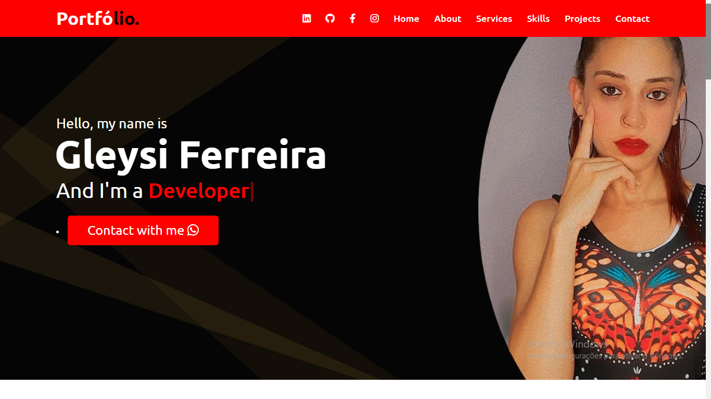
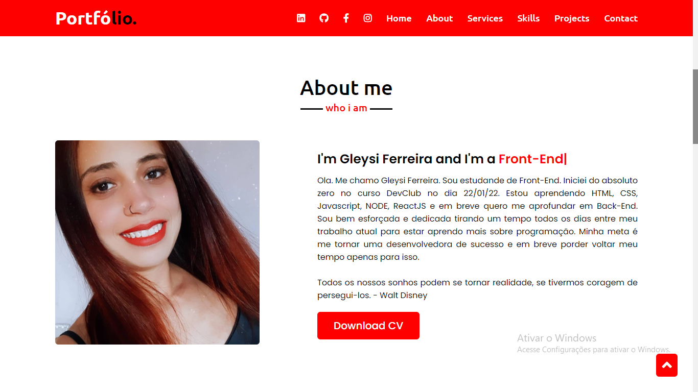
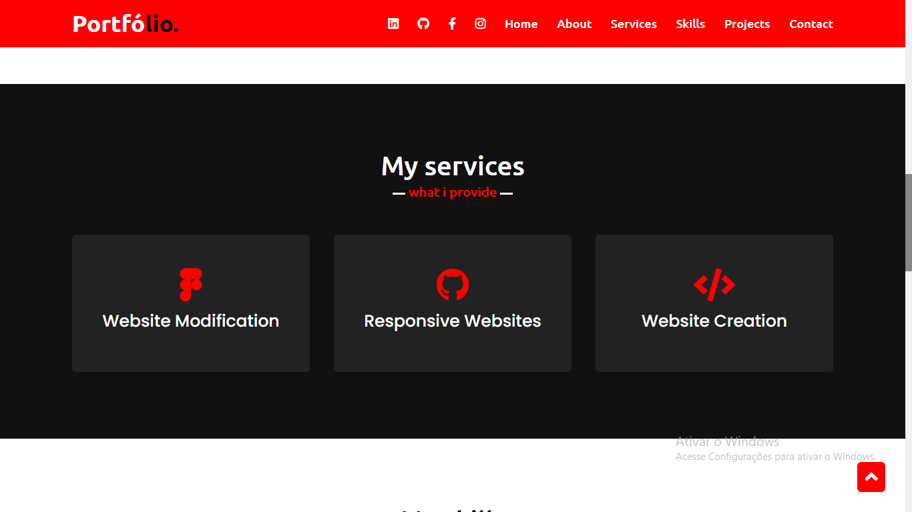
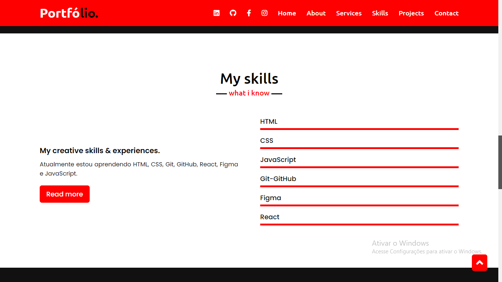
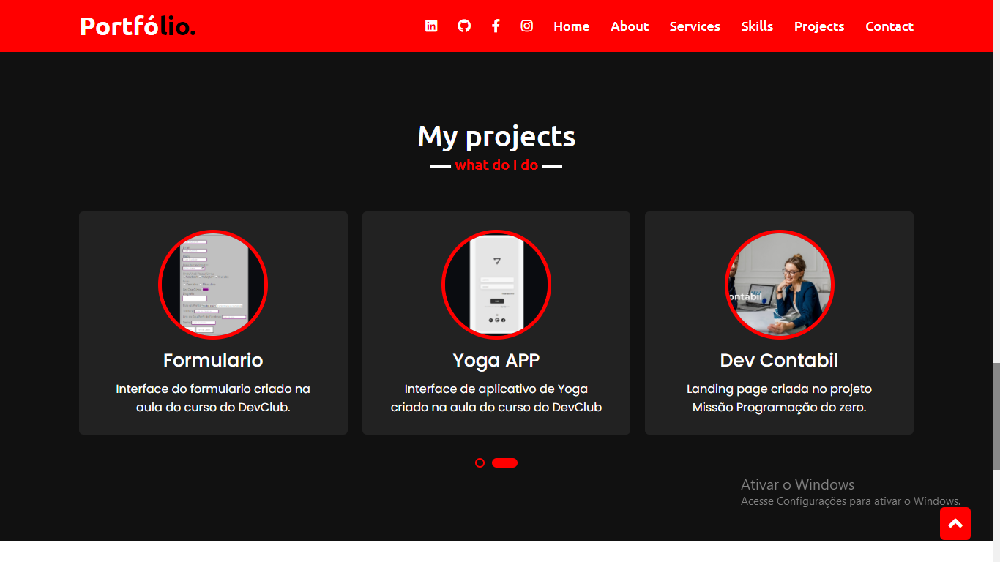
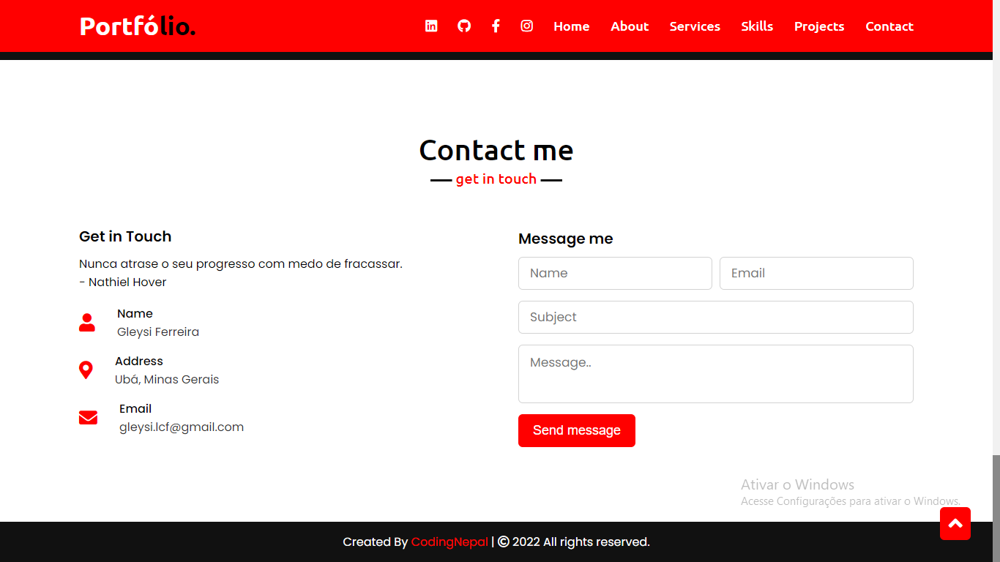

 
 
 

> Resultado do Portifólio finalizado.

O projeto foi criado em:

- [x] Criação do HTML
- [x] Criação do CSS
- [x] Criação do JavaScript

      <a href="file:///C:/Users/Usuario/Desktop/Code%20Club/Portifolio/Portifolio-3/index.html">

## 🤝 Colaboradores

Pessoa que contribuiu para este projeto:

<table>
  <tr>
    <td align="center">
         
        
          <b>Gleysi Ferreira</b>
        
      </a>
    </td>
   </tr>
</table>